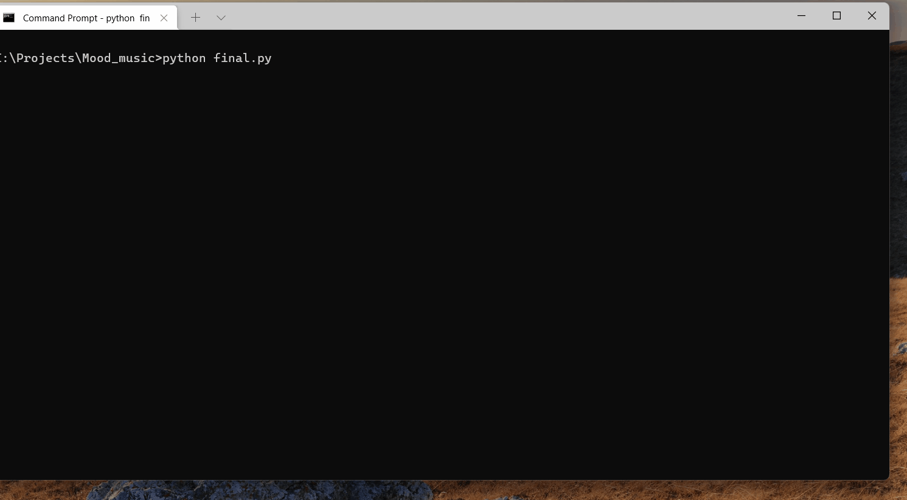

# mood_music
***A python program to detect your emotion and suggest a playlist.***

***This program is written in python using opencv,FER() and tensorflow***

This project was inspired by https://github.com/porridgewithraisins/mood-music-recommendation 
The program uses opencv and FER() module for facial emotion detection and classification.
Then gives a playlist based on the results returned.***Playlist suggestions are welcomed***
This is my first GitHub project so it is quite basic and the github format might not be exact✌️

Next version might include a GUI🤞

***Install***

`git clone https://github.com/AdityaSai2004/mood_music.git`

***Important***

While using the webcam press Space bar to save and Esc key to close window

***Working***

1.You choose your input method either webcam or image(jpg/png is preferred)

2.The FER() module finds the closest emotion

3.Then a playlist is suggested based on the results

